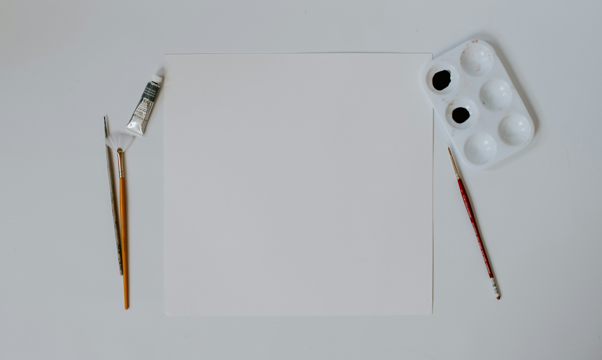

import { Deck, Slide } from "../../components/react/Dex";

<Deck client:load >
    <Slide client:load layout="center">
    # Hello World

    this is a test presentation

    </Slide>
    <Slide client:load>
    ## Slide 2 title

    More content

    </Slide>
    <Slide client:load>

    ## Slide 3 title

    ```python
    print("Hello World")
    ```

    </Slide>
    <Slide client:load>

    ## Image Test

    

    </Slide>
</Deck>
