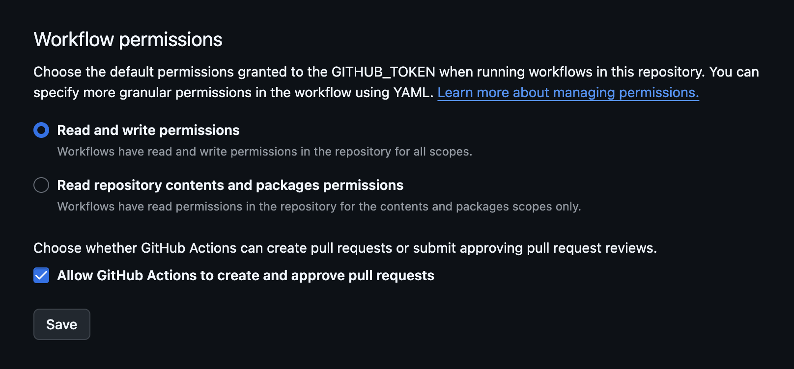

- Simple template to create documentation-style static websites from .md(x) files.
- Made for university project documentations solely based on markdown and mdx content.

> Download manually via the [repository](https://github.com/whatphilipcodes/dox) or use the [instructions](#get-started) below

### Features

- Markdown and MDX support
- Syntax highlighting
- Prebuilt Routes
  - Home
  - Development Log
  - Download
  - Roadmap
- FTP Deployment already set up
  - directly via script
  - workflow for GitHub Actions

### Get Started

- The described method requires the [gh CLI tool](https://cli.github.com/) to be installed

```sh
cd where/you/want && gh repo create desired-name --template whatphilipcodes/dox --public
```

- Afterwards, as this template is based on Astro, everything should work as expected

```sh
cd into/project/root && pnpm i && pnpm dev
```

### Upgrading your installation

From time to time the `dox` repo will be updated to keep operational. In this case you might want to merge the changes into your own project. For that there is a Github Action included that allows you to automatically create a Pull Request with all recent changes. For this to work you have to change the settings for your GitHub repository as follows:



- Afterwards you will be able to run the included `Sync to Template` workflow as expected.
- If you make changes that you don't want to have overwritten with every update just add these to `.templatesyncignore`

---

Based on [Astro's](https://astro.build/) [Blog Example](https://stackblitz.com/github/withastro/astro/tree/latest/examples/blog), the docs are built using [React](https://react.dev/), [Vite](https://vitejs.dev/), [MDX](https://mdxjs.com/), and [Tailwind CSS](https://tailwindcss.com/). Refer to respective documentations for more information.
